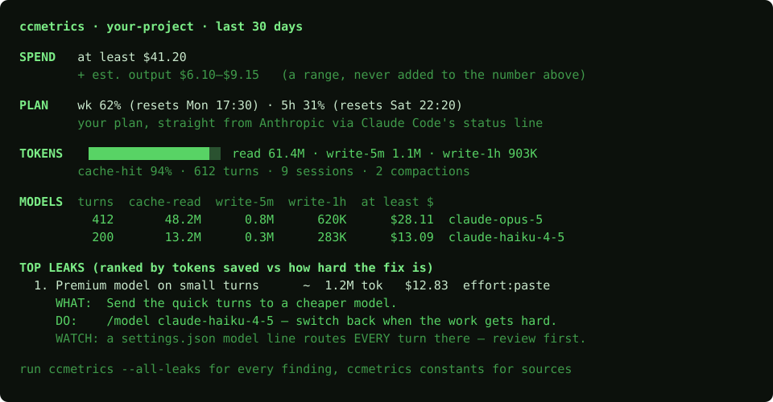
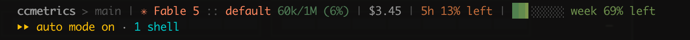
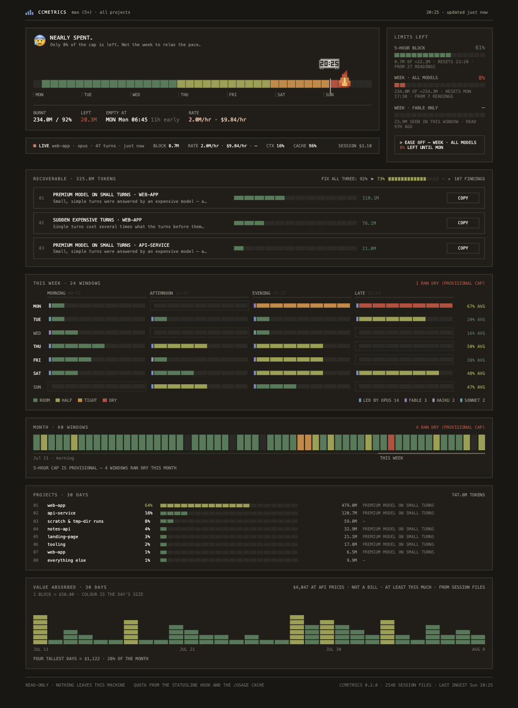
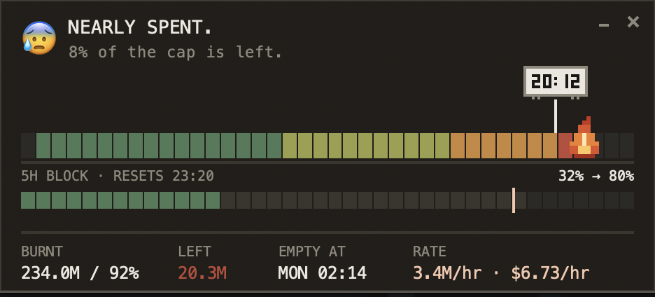
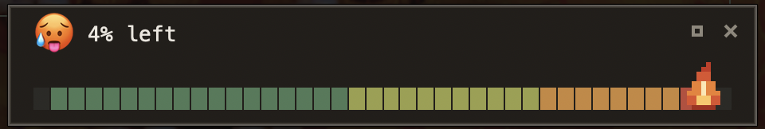

# ccmetrics

<picture>
  <source media="(prefers-color-scheme: dark)" srcset="docs/assets/logo-dark.svg">
  
</picture>

**Will your plan last the week? ccmetrics races your burn against the clock, finds where Claude Code leaks the tokens, and gives you a concrete fix for each leak — most of them paste-ready.**


<sub>[Install](#install) · [When you type, and where](#when-you-type-and-where) · [The views](#the-views) · [Commands](#all-the-commands) · [Detectors](#the-12-leak-detectors) · [Privacy](#privacy)</sub>

`/cost` tells you how much you spent. `ccmetrics` tells you whether the week and the current 5-hour block will last at today's pace, *why* the tokens go, and hands you the exact `CLAUDE.md` line, `settings.json` fragment, or habit that stops the bleed. Local and private: it reads your session logs and never sends them anywhere.

## Install

Python 3.11+. Zero runtime dependencies. [Claude Code](https://claude.com/claude-code) already installed — ccmetrics reads the session logs it writes. Not on PyPI yet:

```bash
git clone https://github.com/flankerad/ccmetrics && cd ccmetrics
uv tool install .            # or: pipx install . / pip install -e .
ccmetrics                    # first run — wires everything below
```

That first run prints your summary, then makes the tool self-maintaining: your plan % goes into Claude Code's status line, the dashboard and widget register to start at login, and the dashboard opens once so you see it. Every run after that just prints. Skip any piece with `--no-dash`, `--no-setup`, or `--no-autostart`. Tk (needed by the widget) and other install notes: [docs/install.md](docs/install.md).

To also ask questions in plain words from inside Claude Code, install the bundled skill globally (one copy, works in every repo):

```bash
mkdir -p ~/.claude/skills && cp -r .claude/skills/ccmetrics ~/.claude/skills/
```

## When you type, and where

The whole idea is that you *don't* type: after the first run the numbers come to you — status line while you work, widget on your desktop, dashboard alive at login. Typing is for exactly four cases:

| You want to | Where you type | What you type |
|---|---|---|
| install or update | terminal | the install block above |
| ask in your own words | Claude Code chat (needs the skill) | *"will my plan last the week?"*, *"what's burning tokens?"*, *"open the dashboard"* |
| dig in right now | terminal | `ccmetrics` for the summary, `ccmetrics dash` for the browser view — full list [below](#all-the-commands) |
| undo the wiring | terminal | `ccmetrics setup --revert` (status line back), `ccmetrics autostart --revert` (login services gone) |

The skill turns a chat question into the right command and answers from real numbers. On its first question of a session it also re-wires anything missing — a status line already occupied by another tool is backed up to `~/.claude/settings.json.bak-ccmetrics` first, and the undo command is printed. Every command the skill or this README documents is parsed against the real CLI by [tests/test_skill_doc.py](tests/test_skill_doc.py), so a moved flag fails a test here instead of reaching you broken.

## The views

**The summary** — what plain `ccmetrics` prints in the terminal: the spend floor, your plan percentages, the token mix, a per-model table, and the top leaks with their fixes.



**The status line** — your plan numbers inside Claude Code itself, no window to open. Repo, branch, model, context used, session cost, then the 5-hour and weekly limits with a bar for the week. Segments with no data simply disappear.



**The dashboard** — `ccmetrics dash`, in your browser, on localhost, no build step.



Top to bottom: the **week fuse** (the flame is your spend, the clock is where the week actually is — flame ahead means you run dry early, and *Empty at* names the moment), **Limits left** (one meter per cap Anthropic reports, and which one to ease off), the **live session** (burn rate, context, cache-hit, cost — a runaway session is flagged while it runs), **Recoverable** (every leak ranked by tokens back ÷ fix effort, with a copy button), the week and month as **5-hour windows** coloured by how tight each ran, **projects** with each one's biggest leak, and **value absorbed** — what your subscription covered at API prices.

**The widget** — `ccmetrics widget`, a small always-on-top window with the same fuse. Drag it anywhere; it needs Tk.



Minimize collapses it to one line — and the face tracks the burn:



## All the commands

```bash
# read (the everyday ones)
ccmetrics             # this repo's summary: plan %, top leaks, paste-ready fixes
ccmetrics --global    # the same across every project
ccmetrics --all-leaks # every finding, not just the top few
ccmetrics dash        # dashboard in your browser
ccmetrics live        # the session running right now
ccmetrics widget      # always-on-top fuse window
ccmetrics constants   # every pricing constant with its source URL
ccmetrics otel        # local OTEL receiver (127.0.0.1:4318) for exact costs

# wire / unwire (first run does the --apply side for you)
ccmetrics setup       # status line: --apply, --check, --revert
ccmetrics autostart   # login services: --apply, --check, --revert
```

The two that write, and their undo:

| Command | Effect | Undo |
|---|---|---|
| `ccmetrics setup --apply` | plan % in your status line; an existing status line is saved to `~/.claude/settings.json.bak-ccmetrics` first | `ccmetrics setup --revert` |
| `ccmetrics autostart --apply` | two login services: one keeps the dash alive, one opens the widget | `ccmetrics autostart --revert` |

## The 12 leak detectors

Ranked by tokens saved ÷ how hard the fix is, filled in with your own numbers. Every saving links its arithmetic: the hits it sums, the threshold it crossed, the pricing constant it used.

| # | Leak | Fix shape |
|---|------|-----------|
| 1 | Cache-miss on idle gaps (resumed past the cache window) | `CLAUDE.md` line |
| 2 | Compaction tax (compacting too late, too often) | `/compact` habit |
| 3 | Context bloat (oversized always-on instructions) | trim list |
| 4 | MCP tool-call overhead (measured per call, not folklore) | config change |
| 5 | Premium model on trivially small turns | `/model` habit |
| 6 | Repeated identical tool calls (same input, same session) | `CLAUDE.md` line |
| 7 | Oversized tool results flowing into context | scoping tip |
| 8 | Sidechain/agent overspend | agent-sizing tip |
| 9 | Retry/error loops burning turns (hooks, denials) | review — your call |
| 10 | Stale-session sprawl (many half-dead sessions) | hygiene tip |
| 11 | Runaway live session (burn ≫ your own p90) | live warning |
| 12 | File re-read waste (same file read 3×+, unchanged) | read-discipline line |

The `CLAUDE.md` lines are safe to paste as-is. The `settings.json` suggestions are starting points — only you know which model choices and denials are deliberate.

## Why the numbers hold up

Claude Code logs every session to `~/.claude/projects/`, but the fields that look like the answer are the wrong ones: `usage.input_tokens` / `output_tokens` are unfinalized streaming placeholders, low by 17–174× ([claude-code#28197](https://github.com/anthropics/claude-code/issues/28197)). ccmetrics prices only the cache token fields — the ones that hold up — × Anthropic's published multipliers, labels the result a floor, and shows output cost as a separate range, never silently summed in. The optional OTEL receiver upgrades the floor to exact. Anything not derivable is shown as unknown — wrong-but-confident is the failure mode this tool exists to avoid.

## Privacy

- **Local only.** No network egress of usage data, no account, no cloud, no telemetry.
- **Metadata only.** Counts, byte sizes, timestamps, tool names, file paths, hashes — **never** prompt text, file contents, or tool-result bodies.
- **Read-only against your session logs**, and exactly two undoable writes elsewhere: the status-line entry in `~/.claude/settings.json` (backed up first) and the login-autostart entries — the [table above](#all-the-commands) has both undo commands.
- **One state file.** SQLite, capped under 100 MB, delete it any time.

## Docs

- [Install notes](docs/install.md) — Tk for the widget, editable installs, login startup, first-run flags.
- [Plan limits](docs/plan-limits.md) — where the 5-hour and weekly percentages come from, and what the status line does to your settings.

## Status

**v0.2.0 — usable.** Ingest, cost floor, all 12 detectors, console summary, dashboard, widget, and optional OTEL exact costs work end to end. Next: PyPI release.

## License

Apache-2.0 — see [LICENSE](LICENSE).

<sub>Built with Claude Code — and pointed back at it.</sub>
