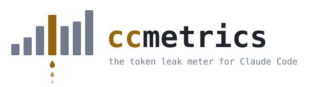

# ccmetrics

<picture>
  <source media="(prefers-color-scheme: dark)" srcset="docs/assets/logo-dark.svg">
  
</picture>

**Find where Claude Code burns your tokens — and get a paste-ready fix for each leak.**


<sub>[Why](#why) · [Use](#use) · [Install](#install) · [Detectors](#the-12-leak-detectors) · [Privacy](#privacy--the-hard-rules) · [Numbers](#numbers-you-can-defend) · [Status](#status)</sub>

`/cost` tells you how much you spent. `ccmetrics` tells you *why*, tracks it over time, and hands you the exact `CLAUDE.md` line, `settings.json` fragment, or habit that stops the bleed. Local, private, read-only.

```
┌ LIVE ── burn 12%/hr │ ctx 61% │ cache-hit 94% │ session at least $0.83 ┐
SPEND 30d  ▂▃▅▇▅▆█  at least $41.20 + $6–9 est. output    TOKEN MIX ██████░░
TOP LEAKS                              SAVES        FIX
1 Cold start after a break             ~1.2M tok    [copy] CLAUDE.md line
2 Compaction tax (9 sessions)          ~640K tok    [copy] /compact habit
3 Premium model on small turns         ~410K tok    [copy] settings.json
▸ per-project ▸ per-session ▸ per-turn timeline
```

## Why

Claude Code writes a detailed JSONL log of every session to `~/.claude/projects/`. Almost nobody reads it — and the tools that do get the numbers wrong:

- **The obvious token fields lie.** `usage.input_tokens` / `output_tokens` are streaming placeholders that undercount by 100–174×. Most dashboards sum them anyway.
- **The cache fields are accurate.** Every dollar figure here is built from cache reads/writes × Anthropic's published multipliers (1.25× / 2× / 0.1×), labelled as a **floor** — never a guess dressed up as a fact.
- **Nobody closes the loop.** Existing tools show charts. None detect *leak patterns* and attach a fix you can paste.

## Use

```bash
ccmetrics        # inside a repo → that repo's summary: top leaks + paste-ready fixes
ccmetrics dash   # anywhere → global dashboard in your browser, per-project drill-down
ccmetrics otel   # optional → local OTEL receiver (127.0.0.1:4318) for exact costs
```

The dashboard glance view, zero clicks: live session tiles (burn rate, context %, cache-hit, spend — a runaway session gets flagged *while it's running*), 30-day spend trend, token mix, top leaks ranked by `tokens saved ÷ effort` each with a copy button, and a per-project table.

## Install

Python 3.11+. Zero runtime dependencies — stdlib SQLite, stdlib HTTP server, one static HTML page.

```bash
# today (from a clone — not on PyPI yet):
git clone https://github.com/flankerad/ccmetrics && cd ccmetrics
uv tool install .            # or: pipx install . / pip install -e .

# after the PyPI release:
uv tool install ccmetrics    # or: pipx install ccmetrics
```

One install covers every project on the machine: it reads all of `~/.claude/projects/`, keeps per-project data separate, and rolls it up globally in the dash.

## The 12 leak detectors

Each ships a pre-written fix template filled from your own numbers:

| # | Leak | Fix shape |
|---|------|-----------|
| 1 | Cache-miss on idle gaps (resumed past the cache window) | `CLAUDE.md` line |
| 2 | Compaction tax (compacting too late, too often) | `/compact` habit |
| 3 | Context bloat (oversized always-on instructions) | trim list |
| 4 | MCP tool-call overhead (measured per call, not folklore) | config change |
| 5 | Premium model on trivially small turns | `/model` habit (`settings.json` routing as a reviewed option) |
| 6 | Repeated identical tool calls (same input, same session) | `CLAUDE.md` line |
| 7 | Oversized tool results flowing into context | scoping tip |
| 8 | Sidechain/agent overspend | agent-sizing tip |
| 9 | Retry/error loops burning turns (hooks, denials) | review — keep or allowlist, your call |
| 10 | Stale-session sprawl (many half-dead sessions) | hygiene tip |
| 11 | Runaway live session (burn ≫ your own p90) | live warning |
| 12 | File re-read waste (same file read 3×+, unchanged) | `CLAUDE.md` read-discipline line |

Every saving shown links its arithmetic: the detector hits it sums, the threshold it crossed, and the pricing constant (with source URL) it used.

One honesty rule: the `CLAUDE.md` lines and habits are safe to paste as-is; the `settings.json` suggestions are starting points — read them first, because only you know which model choices and permission denials are deliberate.

## Privacy — the hard rules

- **Local only.** No network egress of usage data, no account, no cloud, no telemetry.
- **Metadata only.** Stores counts, byte sizes, timestamps, tool names, file paths, and hashes — **never** prompt text, file contents, or tool-result bodies.
- **Read-only against `~/.claude`.** It cannot damage your Claude Code install or sessions.
- **Proposes, never applies.** No file of yours is ever edited. You read the fix, you paste it.
- One state file (SQLite, capped under 100 MB); delete it any time — nothing of yours is lost.

## Numbers you can defend

- Dollar figures are a **floor** computed from accurate cache fields × published Anthropic multipliers. Output cost appears as a clearly-labelled byte-derived *range*, never silently summed in.
- Cost confidence is a visible UI state: approximate (JSONL-only) vs exact (optional OTEL upgrade).
- Every pricing constant and detector threshold lives in one versioned lookup file, each entry with a source URL.
- Anything not derivable is shown as unknown — wrong-but-confident is the failure mode this tool exists to avoid.

## Status

**v0.2.0 — usable.** Ingest, cost floor, all 12 detectors, console summary, localhost dashboard, and optional OTEL exact costs work end-to-end (70-test suite green; cold ingest of a 522 MB corpus in ~5 s). Next: PyPI release.

## License

Apache-2.0 — see [LICENSE](LICENSE).
